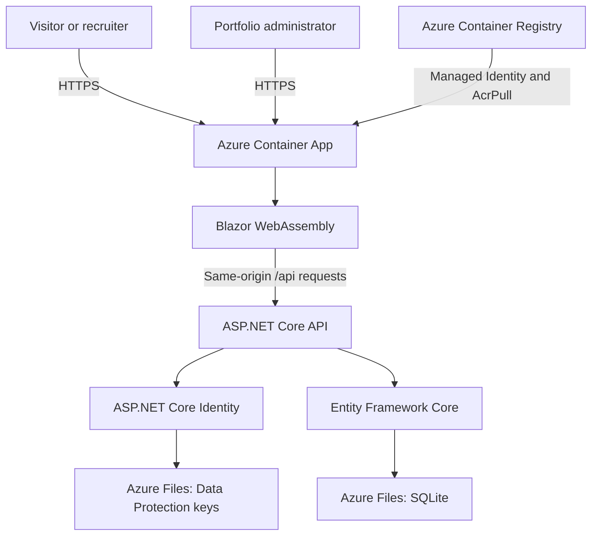

# SkillSnap

SkillSnap is a full-stack portfolio application created by **Christoper Chaves
Lee**. It presents projects and technical skills publicly while providing a
protected administration area for managing portfolio content and contact
messages.

The project demonstrates full-stack development with .NET, Blazor WebAssembly,
ASP.NET Core, Entity Framework Core, Docker, automated testing, and Azure
container hosting.

## Live Application

SkillSnap is publicly available at:

[https://ca-christoper-portfolio-prod.politesea-922c005b.eastus.azurecontainerapps.io](https://ca-christoper-portfolio-prod.politesea-922c005b.eastus.azurecontainerapps.io)

The administration area is intentionally not linked from the public navigation.

## Features

### Public portfolio

- Public Home and Projects pages without visitor authentication.
- Project and technical skill presentation.
- Contact form presented in an accessible modal.
- Shared client and server validation.
- Honeypot protection against automated submissions.
- Fixed-window rate limiting for contact submissions.
- Persistent contact message storage.

### Administration

- Protected administration area at `/admin`.
- Closed public registration.
- ASP.NET Core Identity authentication.
- Role-based authorization using the `Admin` role.
- Project and skill creation, editing, and deletion.
- Project-to-skill many-to-many relationships.
- Administrative contact message inbox.
- Automatic administrator bootstrap from secure configuration.

### Security

- `HttpOnly` authentication cookies.
- Secure cookies in production.
- Antiforgery validation for state-changing requests.
- Generic invalid-login responses.
- Account lockout after repeated failed sign-in attempts.
- Server-side authorization on administrative endpoints.
- DTOs separated from EF Core entities.
- Secrets excluded from source control.

## Technology Stack

- .NET 10
- C#
- Blazor WebAssembly
- ASP.NET Core Web API
- ASP.NET Core Identity
- Entity Framework Core
- SQLite
- xUnit
- Bootstrap
- Docker
- Azure Container Apps
- Azure Container Registry
- Azure Files
- Azure Managed Identity

## Architecture



The ASP.NET Core application serves both the API and the published Blazor
WebAssembly client from one container. Production browser requests remain on one
HTTPS origin, simplifying cookie authentication and API configuration.

The browser only receives public request and response contracts. EF Core
entities and persistence relationships remain inside the API.

See [the architecture documentation](docs/architecture.md) for the detailed
runtime design and production tradeoffs.

## Solution Structure

```text
SkillSnap.Client       Blazor WebAssembly UI and client services
SkillSnap.Api          Controllers, Identity, EF Core, hosting, and persistence
SkillSnap.Contracts    Shared request and response DTOs
SkillSnap.Api.Tests    Integration tests using isolated SQLite
docs                   Architecture, deployment, and design documentation
```

## Application Flows

### Public portfolio

1. A visitor opens the application without signing in.
2. The Blazor client requests projects and skills from the API.
3. The API returns public response DTOs.
4. The client renders the portfolio.

### Contact submission

1. The visitor opens the contact modal.
2. Client-side validation provides immediate feedback.
3. The client obtains a session and antiforgery token when required.
4. The request is submitted to `POST /api/contact`.
5. The API applies antiforgery validation, honeypot handling, rate limiting, and
   server-side validation.
6. The valid message is stored in SQLite.
7. The API returns `202 Accepted`.

### Administrator sign-in

1. The client requests the current session and an antiforgery token.
2. The administrator submits credentials to `POST /api/auth/login`.
3. ASP.NET Core Identity validates the credentials and lockout state.
4. The API creates an `HttpOnly` authentication cookie.
5. The client navigates to the protected administration area.

### Protected content change

1. The Admin UI sends a state-changing request with the authentication cookie
   and `X-CSRF-TOKEN` header.
2. ASP.NET Core validates the antiforgery token.
3. Authorization requires the authenticated user to have the `Admin` role.
4. The controller validates and maps the request DTO.
5. EF Core persists the change.
6. The API returns the updated response or a successful empty response.

## Access Model

Visitors can read portfolio content and submit contact messages without an
account. They cannot register, sign in as public users, or access administrative
operations.

The owner signs in directly at:

```text
/admin/login
```

The administration area is:

```text
/admin
```

Hiding the administrative link is only a user-experience decision. Every
protected API operation independently enforces authentication and the `Admin`
role.

## API Routes

| Method | Route | Access | Purpose |
| --- | --- | --- | --- |
| GET | `/api/auth/session` | Public | Return the current session and antiforgery token |
| POST | `/api/auth/login` | Public + antiforgery | Create the administrator session |
| POST | `/api/auth/logout` | Authenticated + antiforgery | End the current session |
| GET | `/api/projects` | Public | Return public projects |
| POST | `/api/projects` | Admin + antiforgery | Create a project |
| PUT | `/api/projects/{id}` | Admin + antiforgery | Update a project |
| DELETE | `/api/projects/{id}` | Admin + antiforgery | Delete a project |
| GET | `/api/skills` | Public | Return public skills |
| POST | `/api/skills` | Admin + antiforgery | Create a skill |
| PUT | `/api/skills/{id}` | Admin + antiforgery | Update a skill |
| DELETE | `/api/skills/{id}` | Admin + antiforgery | Delete a skill |
| GET | `/api/contact` | Admin | Return stored contact messages |
| POST | `/api/contact` | Public + antiforgery + rate limiting | Submit a contact message |
| POST | `/api/seed` | Admin + antiforgery | Insert sample data when no portfolio owner exists |

There is no public registration endpoint. Unknown `/api/*` routes return API
`404 Not Found` responses instead of the Blazor application fallback.

## Local Development

### Prerequisites

- .NET SDK 10
- A modern browser
- EF Core CLI tools when migrations are managed manually

### Restore, build, and test

From the solution directory:

```powershell
dotnet restore SkillSnap.slnx
dotnet build SkillSnap.slnx --no-restore
dotnet test SkillSnap.slnx --no-build
```

The verified test suite currently contains **46 passing tests**.

### Configure the local administrator

The API project uses .NET User Secrets for local administrator credentials:

```powershell
dotnet user-secrets set "Admin:Email" "admin@example.com" `
    --project .\SkillSnap.Api\SkillSnap.Api.csproj

dotnet user-secrets set "Admin:Password" "use-a-development-only-password" `
    --project .\SkillSnap.Api\SkillSnap.Api.csproj
```

Do not reuse a personal password.

### Initialize the local database

```powershell
dotnet ef database update `
    --project .\SkillSnap.Api\SkillSnap.Api.csproj `
    --startup-project .\SkillSnap.Api\SkillSnap.Api.csproj
```

The application also applies pending EF Core migrations during startup.

### Run locally

Start the API:

```powershell
dotnet run --project .\SkillSnap.Api\SkillSnap.Api.csproj --launch-profile http
```

Start the Blazor client in another terminal:

```powershell
dotnet run --project .\SkillSnap.Client\SkillSnap.Client.csproj --launch-profile http
```

Open:

```text
http://localhost:5008
```

Local HTTP is a development convenience. Production uses HTTPS.

## Docker

### Configuration

Copy the example environment file:

```powershell
Copy-Item .\.env.example .\.env
```

Set development-only values for:

```text
Admin__Email
Admin__Password
```

The Docker configuration uses:

```text
ConnectionStrings__SkillSnap=Data Source=/data/skillsnap.db
DataProtection__KeysPath=/keys
```

The `.env` file is excluded from Git.

### Build the image

```powershell
docker build --file .\SkillSnap.Api\Dockerfile --tag skillsnap-api:local .
```

### Start the local container

```powershell
docker compose up --detach --build
```

Open:

```text
http://localhost:8080
```

Docker Compose mounts two named volumes:

- `skillsnap-data` at `/data`.
- `skillsnap-keys` at `/keys`.

The first volume preserves SQLite data. The second preserves ASP.NET Core Data
Protection keys so authentication cookies can remain valid after container
replacement.

### Stop the container

```powershell
docker compose down
```

Named volumes are intentionally retained unless explicitly removed.

## Production Deployment

SkillSnap is deployed to Azure using:

- Azure Container Registry for the private application image.
- Azure Container Apps with the Consumption workload profile.
- External HTTPS ingress on container port `8080`.
- Azure Files for SQLite and Data Protection key persistence.
- A user-assigned Managed Identity with the `AcrPull` role.
- Azure Container Apps secrets for administrator configuration.
- A minimum of `0` replicas and maximum of `1` replica.
- Log Analytics disabled for the current cost-conscious deployment.

The maximum replica count is intentionally limited to one while SQLite remains
the production database. Horizontal scaling should only be enabled after moving
to a database designed for concurrent multi-instance access.

The deployment configuration is defined in:

```text
containerapp.yaml
```

Secret values are not stored in that file or committed to source control.

See [the deployment guide](docs/deployment.md) for the deployment sequence,
persistent storage design, verification steps, and operational cautions.

## Persistence and Migrations

Production uses:

```text
/data/skillsnap.db
/keys
```

Both paths are backed by Azure Files and survive revision replacement and
container restarts.

At startup, the API:

1. Applies pending EF Core migrations.
2. Reads administrator configuration.
3. Creates the administrator when necessary.
4. Ensures the administrator belongs to the `Admin` role.
5. Starts serving HTTP requests.

Database migrations and administrator bootstrap must complete before the
application accepts traffic.

## Validation and Public Contracts

Create and update endpoints accept dedicated request DTOs. Database-generated
IDs, navigation properties, and `PortfolioUserId` are not accepted from the
browser. Route IDs are the source of identity for updates.

Public responses include only fields required by the UI. The API maps EF Core
entities explicitly instead of serializing persistence models directly.

Client validation improves usability. API validation remains authoritative, and
database constraints provide the final integrity boundary.

## Automated Tests

Run all tests with:

```powershell
dotnet test SkillSnap.slnx
```

The test suite covers:

- Session bootstrap and antiforgery token generation.
- Closed public registration.
- Valid and invalid administrator authentication.
- Authentication cookie behavior.
- Role-based authorization.
- Project and skill reads and mutations.
- Public DTO boundaries.
- Validation failures without persistence.
- Contact submission and storage.
- Honeypot handling.
- Contact rate limiting.
- Administrative contact message access.

Integration tests execute the real ASP.NET Core pipeline with isolated test
infrastructure. They do not use the development or production SQLite database.

## Security Decisions

- Authentication secrets are not stored in browser storage.
- The authentication cookie is `HttpOnly`.
- Production cookies require HTTPS.
- Unsafe requests require an antiforgery token.
- Invalid login responses do not reveal whether an account exists.
- Repeated failed sign-in attempts trigger Identity lockout.
- Controllers enforce the `Admin` role independently of UI visibility.
- Public registration is disabled.
- EF Core entities are not exposed as public contracts.
- Container registry credentials are replaced by Managed Identity.
- Administrator values are stored as platform secrets.
- Local databases, `.env`, certificates, keys, build output, and IDE state are
  excluded from Git.

## Operational Constraints

### Required now

- Public HTTPS portfolio access.
- Protected administration.
- Persistent projects, skills, and messages.
- Persistent Data Protection keys.
- One production replica while using SQLite.
- Cost monitoring and budget alerts.
- Reproducible Docker and Azure configuration.

### Prepared for later

- Automated CI/CD deployment.
- Scheduled production backups.
- Custom domain configuration.
- Application monitoring if the added cost is justified.
- Migration to a managed relational database when concurrency requires it.

### Intentionally unnecessary now

- Public accounts.
- Social login.
- Refresh tokens.
- Microservices.
- Distributed caching.
- Message queues.
- Kubernetes.
- Multiple application replicas with SQLite.
- A paid custom domain for the initial deployment.

## Documentation

- [Architecture](docs/architecture.md)
- [Deployment Guide](docs/deployment.md)
- [Phase 1 Design](docs/phase-1-design.md)

## Current Status

- Build: successful.
- Automated tests: 46 passed.
- Release publish: successful.
- Docker image: built and validated.
- Azure deployment: active.
- Production persistence: verified after a container revision restart.
- Public projects: verified.
- Administrator authentication: verified.
- Contact submission and Admin inbox: verified.

No commit, push, image publication, infrastructure change, or deployment should
be performed without reviewing the result and receiving explicit authorization.