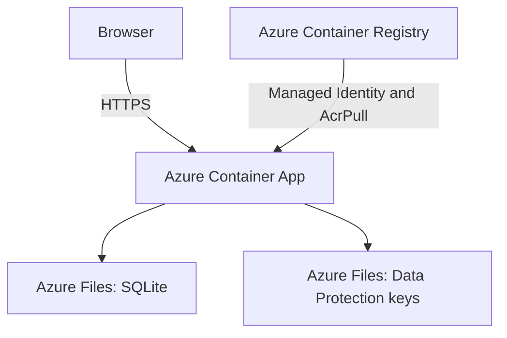

# SkillSnap Architecture

## Purpose

SkillSnap is a full-stack portfolio application built with ASP.NET Core and
Blazor WebAssembly. It provides a public portfolio, a protected administration
area, and a persistent contact workflow.

This document describes the current production architecture and its technical
tradeoffs.

## System Overview



The ASP.NET Core application serves both the API and the published Blazor
WebAssembly client from one container and one origin.

## Solution Components

### SkillSnap.Client

The Blazor WebAssembly client contains:

- Public Home and Projects pages.
- The contact modal.
- Administrator sign-in.
- Project and skill management.
- The administrative contact inbox.

The production client uses `/` as its API base URL. Browser requests therefore
remain on the same HTTPS origin as the application.

### SkillSnap.Api

The ASP.NET Core application provides:

- REST endpoints for authentication, projects, skills, and contact messages.
- ASP.NET Core Identity with an `Admin` role.
- Antiforgery validation for unsafe requests.
- Fixed-window rate limiting for contact submissions.
- EF Core migrations and administrator bootstrap during startup.
- Static asset hosting for the published Blazor client.
- Fallback routing for client-side navigation.

Unknown `/api/*` routes return API `404 Not Found` responses instead of the
Blazor `index.html` fallback.

### SkillSnap.Contracts

The contracts project contains request and response DTOs shared by the client
and API. EF Core entities are not exposed directly to the browser.

### SkillSnap.Api.Tests

The xUnit project runs integration tests against the ASP.NET Core pipeline using
isolated test infrastructure.

## Request Flow

1. The browser loads the Blazor WebAssembly client over HTTPS.
2. Client services send same-origin requests to `/api/*`.
3. ASP.NET Core applies rate limiting, authentication, authorization, and
   antiforgery validation as required by the endpoint.
4. Controllers validate DTOs and map allowed fields.
5. EF Core reads or writes the SQLite database.
6. The API returns an HTTP response to the client.

## Contact Flow

1. A visitor opens the contact modal.
2. Client-side validation provides immediate feedback.
3. The client obtains a session and antiforgery token when required.
4. `POST /api/contact` applies antiforgery validation and rate limiting.
5. Honeypot submissions receive `202 Accepted` without being persisted.
6. Valid requests are normalized and validated by the API.
7. EF Core stores the message in SQLite.
8. An authenticated Admin can read messages through `GET /api/contact`.

## Authentication and Security

- Public portfolio endpoints do not require authentication.
- Administrative endpoints require the `Admin` role.
- Authentication uses an `HttpOnly` cookie.
- Production cookies require HTTPS.
- Unsafe requests require the `X-CSRF-TOKEN` header.
- Failed sign-in attempts use ASP.NET Core Identity lockout.
- Public registration is disabled.
- Administrator values are stored as Azure Container Apps secrets.
- The container pulls its private image through a user-assigned Managed Identity
  with only the `AcrPull` role.
- EF Core entities remain internal to the API.

## Data Persistence

The production SQLite database is mounted at:

```text
/data/skillsnap.db
```

ASP.NET Core Data Protection keys are mounted separately at:

```text
/keys
```

Both paths use Azure Files. This keeps portfolio data and authentication cookies
available when the container restarts or a new revision replaces it.

EF Core migrations run during startup before administrator bootstrap.

## Production Topology

The deployment uses:

- Azure Container Apps with the Consumption workload profile.
- Azure Container Registry for the private image.
- Azure Files for persistent application data.
- A user-assigned Managed Identity for registry access.
- External HTTPS ingress targeting port `8080`.
- A minimum of `0` replicas.
- A maximum of `1` replica.
- No Log Analytics workspace in the current deployment.

The single-replica limit is intentional. SQLite is suitable for the current
low-traffic portfolio, but it is not treated as a horizontally scalable
database.

## Design Decisions

### Same-origin hosting

The API serves the published Blazor client. This avoids maintaining separate
production origins and simplifies cookie, antiforgery, and API URL behavior.

### SQLite

SQLite keeps the current data layer small and inexpensive. Azure Files provides
persistence outside the container lifecycle.

This design accepts additional network latency and is limited to one application
replica. A managed relational database becomes appropriate if concurrent writes,
availability, or horizontal scaling requirements increase.

### Scale-to-zero

The Consumption profile can reduce idle compute usage to zero replicas. The
tradeoff is a possible cold start on the first request after inactivity.

### Managed Identity

The Container App does not store an Azure Container Registry username or
password. Its identity receives only the `AcrPull` role scoped to the registry.

### Separate Data Protection storage

Data Protection keys are stored separately from the SQLite database. Persisting
them prevents authentication cookies from becoming invalid after routine
container restarts.

## Current Limitations

- Cold starts may delay the first request after inactivity.
- One replica limits availability and throughput.
- SQLite on network-backed storage is intended only for the current low-volume
  workload.
- Application logs are not sent to Log Analytics.
- Production backups are not yet automated.
- Deployment is currently manual.

## Future Evolution

The next infrastructure improvements should be driven by actual requirements:

1. Add an automated backup process.
2. Add CI/CD after the manual deployment process is stable.
3. Enable monitoring if its operational value justifies the cost.
4. Move to a managed relational database before enabling multiple replicas.
5. Add a custom domain only if it provides sufficient portfolio value.