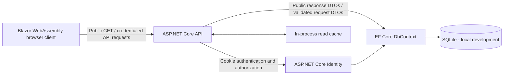
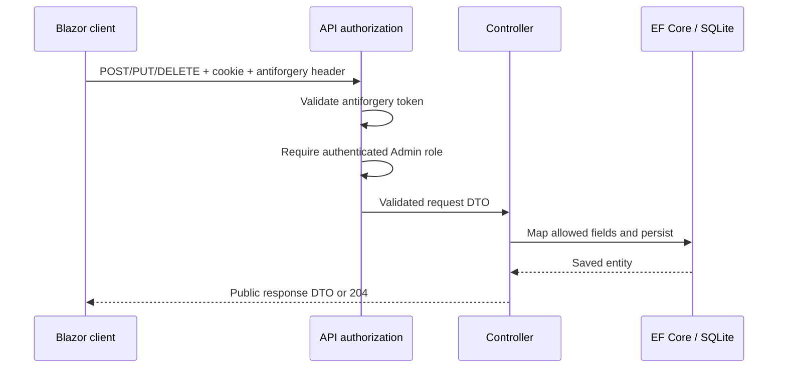

# SkillSnap Phase 1 Design

## Purpose

Phase 1 turns the capstone into a small, production-oriented portfolio while
preserving the existing Blazor WebAssembly client, ASP.NET Core API, and SQLite
development workflow. The design deliberately favors a narrow attack surface
and explicit contracts over additional infrastructure.

## Verified Baseline

- The solution contains a standalone Blazor WebAssembly client and an ASP.NET
  Core controller API targeting .NET 10.
- Entity Framework Core and ASP.NET Core Identity share a SQLite database.
- Public reads are cached in process; mutations invalidate the relevant cache.
- The solution builds with no warnings or errors.
- No automated test project exists in the baseline.
- Public registration creates a `User`, and both `User` and `Admin` can mutate
  the shared portfolio.
- The browser stores a bearer JWT and identity data in `localStorage`.
- Project and skill endpoints bind and return EF Core entities directly.
- The UI supplies a fixed `PortfolioUserId` of `1`.
- A local SQLite database and generated `bin` and `obj` directories exist.
- No active reference to "Jordan" was found. Sample portfolio data identifies
  the owner as Christoper Chaves Lee.
- No committed configuration secret was found. The baseline expects a JWT key
  in .NET user secrets, but the directory was not yet a Git repository.

## Phase 1 Architecture



The client and API remain independently hosted during local development. CORS
allows only the configured client origin and permits credentials. The API owns
all persistence models and mapping. The browser only knows public contracts.

## Authentication and Authorization Decision

Use the ASP.NET Core Identity application cookie instead of a JWT stored in
browser storage. The authentication cookie is `HttpOnly`, `Secure` outside local
HTTP development, and restricted with an appropriate `SameSite` policy. The
browser sends it only on credentialed API requests; JavaScript cannot read it.

Because browsers attach cookies automatically, every state-changing request
must also carry an antiforgery token. The API provides a safe token bootstrap
endpoint, and the client sends the token in a custom header. CORS is restricted
to the configured client origin and allows credentials.

Public self-registration is removed. Login, logout, and current-session
inspection remain. Only the `Admin` role may create, update, delete, or seed
portfolio content. Invalid login responses remain generic to reduce account
enumeration. Identity lockout remains enabled for failed password attempts.

The first administrator is an operational concern. Development bootstrap may
read credentials from .NET user secrets; production must supply credentials
through its secret store or use a one-time controlled provisioning process.
Credentials never belong in source control.

### Authentication flow

```mermaid
sequenceDiagram
    participant B as Blazor client
    participant A as API
    participant F as Antiforgery service
    participant I as ASP.NET Core Identity

    B->>A: GET /api/auth/session (credentials included)
    A->>F: Generate antiforgery token
    A-->>B: Session DTO + request token
    B->>A: POST /api/auth/login + antiforgery header
    A->>F: Validate token
    A->>I: Validate credentials and lockout state
    I-->>A: Authenticated Admin
    A-->>B: Set-Cookie: HttpOnly; session DTO
    Note over B,A: JavaScript never receives an authentication secret
```

### Protected mutation flow



## Public Contracts and Validation

- Request and response DTOs live in a shared contracts project referenced by
  both client and API.
- EF Core entities remain internal persistence concerns of the API.
- Clients cannot set database-generated IDs, navigation properties, ownership
  relationships, or other persistence-only fields on create.
- Update identity comes from the route, not a duplicated body ID.
- Data annotations provide transport-level validation, while controller/service
  logic enforces domain and existence rules.
- Public GET endpoints return only the fields required by the portfolio UI.

## Git Hygiene

Initialize a repository at the solution root and ignore Visual Studio/Rider/VS
Code personal state, build outputs, test results, local databases and journals,
logs, user-secret-like configuration files, certificates, and environment files.
Keep migrations and non-secret application configuration tracked. Do not commit,
push, publish, or deploy during Phase 1 without explicit authorization.

## Scope Classification

### Required now

- Git initialization and repository hygiene.
- Closed public registration.
- Identity cookie authentication with antiforgery protection.
- Admin-only mutation and seed endpoints.
- Shared DTOs and explicit entity mapping.
- Server-side validation and safe error contracts.
- Automated integration tests for authentication, authorization, validation,
  and public endpoints.
- Build and test verification after each implementation stage.
- Accurate architecture and flow documentation.

### Prepared for later

- Environment-backed production connection strings and allowed origins.
- Controlled production administrator provisioning.
- Migration from SQLite when concurrency or hosting requirements demand it.
- CI quality gates, deployment, observability, backups, and rate limiting.
- Per-user ownership if SkillSnap becomes a multi-user product.

### Intentionally unnecessary now

- Public accounts, refresh tokens, or a custom token server.
- Microservices, distributed cache, message queues, or Kubernetes.
- Repository/service abstractions that only wrap EF Core without adding policy.
- Cloud database, social login, image storage, or multi-tenancy.

## Acceptance Criteria

1. The repository is initialized locally, contains an appropriate `.gitignore`,
   and `git status` does not offer local databases, build output, secrets, or
   personal IDE files for tracking.
2. `POST /api/auth/register` is unavailable and the client exposes no register
   navigation or registration form.
3. A valid administrator can log in and receives an `HttpOnly` authentication
   cookie; no JWT or authentication secret is stored in `localStorage`.
4. Invalid credentials return `401` with a generic message, and logout removes
   the authenticated session.
5. Unsafe requests without a valid antiforgery token are rejected.
6. Anonymous and non-admin callers cannot create, update, delete, or seed data;
   an administrator can perform each supported mutation.
7. Project and skill controllers accept request DTOs and return response DTOs;
   controller action signatures do not expose EF Core entities.
8. Invalid request data returns `400` with validation details and is not saved.
9. Public project and skill reads remain anonymous, return the documented DTO
   shape, and do not expose navigation properties or persistence ownership IDs.
10. SQLite remains the local development database and migrations remain usable.
11. Automated tests cover login success/failure, closed registration, logout,
    antiforgery enforcement, role authorization, validation, and public reads.
12. The entire solution builds with no errors, and all automated tests pass.
13. Documentation and code use English; user-facing project ownership identifies
    Christoper Chaves Lee and no stale "Jordan" reference remains.
14. No commit, remote push, publish, or deployment occurs without explicit user
    authorization.

## Risks and Mitigations

| Risk | Mitigation |
| --- | --- |
| Cookie authentication introduces CSRF exposure | Validate antiforgery tokens on every unsafe endpoint |
| Cross-origin development drops cookies | Explicit origin, credentialed CORS, and browser credentials mode |
| Over-posting changes persistence-only fields | Separate request DTOs and explicit mapping |
| Closing registration leaves no administrator | Secret-backed, controlled bootstrap/provisioning documentation |
| Existing local data conflicts with schema or roles | Preserve the database, use migrations, and avoid destructive reset |
| Tests accidentally use developer data | Isolated in-memory SQLite database per test application |
